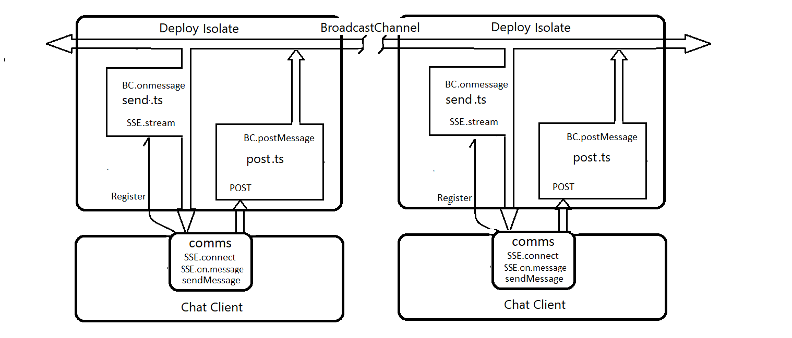

# Deno SSE-BC Chat
A super simple Chat-App that leverages Deno BroadcastChannel to bridge Deploy Isolates.   
This example uses Server Sent Events - SSE - rather than WebSockets for chat communications.   
 
 
 
This server will auto-launch your default browser to /client/index.html.    
To exercise the app, you'll need to open two copies. http://localhost:8080   

To run this demo, from a terminal in the root folder enter:
```
deno run -A --unstable server.ts
```

I like to open each side-by-side, in two separate browser windows.  

  